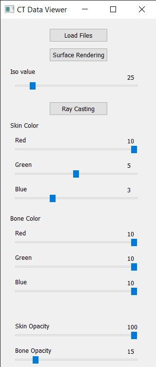
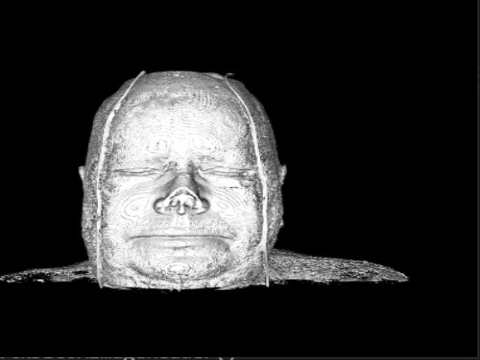
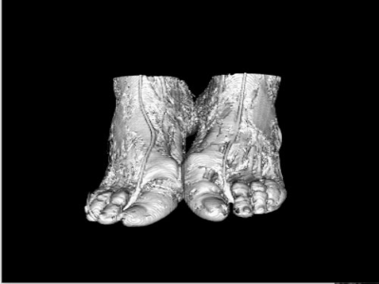
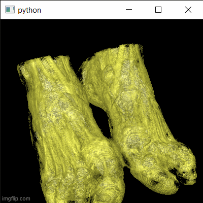
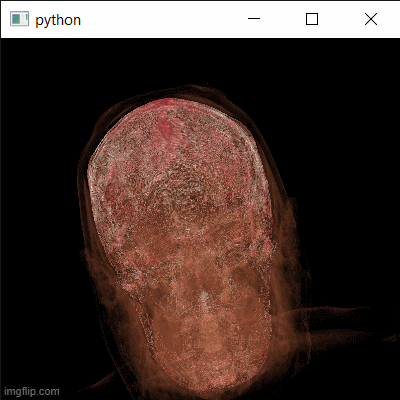
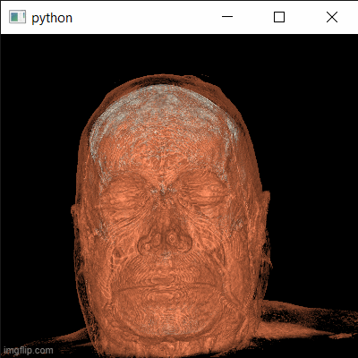
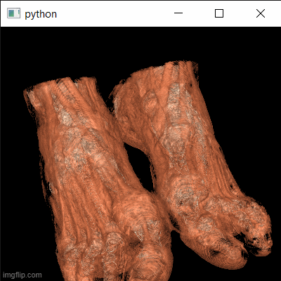
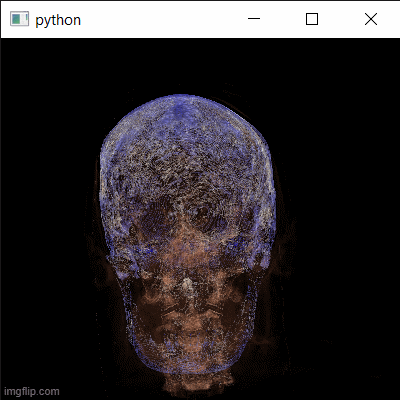

# Medical Visualization

### Building a volume rendering app with VTK & Qt Using datasets of type DICOM (Digital Imaging and Communications in Medicine) through following steps:

1. Loading the data series using load button by chosing the directory containing our datasets.
2. Surface rendering (With adjustable iso value) using sliders.
3. Ray casting rendering.

------
# 1. GUI :



* ### Using Load Files push button to get our directory of data.

* ### Using Surface Rendering push button to connect to  vtk_rendering function.

* ### Using Ray Casting push button to connect to  rayCasting function.

* ### iso_slider is used to change iso value in Surface rendering .

* ### Sliders are used to change the RGB values and Opacity for both Skin and Bone Tissues.

  ```python
  class AppWindow(QMainWindow):
      def __init__(self):
          super().__init__()
          self.ui = Ui_MainWindow()
          self.ui.setupUi(self)
          self.ui.Browse.clicked.connect(read_dcm)        #Load files Button
          self.ui.sRender.clicked.connect(vtk_rendering)  #surface rendering button
          self.ui.horizontalSlider.valueChanged.connect(iso_slider) #iso slider
          self.ui.vRender.clicked.connect(rayCasting)     #ray casting button
          self.ui.horizontalSlider_2.valueChanged.connect(sRed)   #red color component for Skin tissue 
          self.ui.horizontalSlider_3.valueChanged.connect(sGreen)	#green color component for Skin tissue
          self.ui.horizontalSlider_4.valueChanged.connect(sBlue)	#blue color component for Skin tissue
          self.ui.horizontalSlider_5.valueChanged.connect(bRed)	#red color component for Bone tissue
          self.ui.horizontalSlider_6.valueChanged.connect(bGreen)	#green color component for Bone tissue
          self.ui.horizontalSlider_7.valueChanged.connect(bBlue)	#blue color component for Bone tissue
          self.ui.horizontalSlider_8.valueChanged.connect(sOpacity)#Opacity set for Skin tissue
          self.ui.horizontalSlider_9.valueChanged.connect(bOpacity)#Opacity set for Bone tissue
          self.show()  
  ```

  # 2. Reading Files :

* ### connecting to read_dcm function to browse our series of data which is in our task (Head or Ankle directories).

* #### If path detected validation message appears and path saved in global variable "mypath".

```python
def read_dcm():
        fname = QtWidgets.QFileDialog.getExistingDirectory(None,"Open dcm's folder",os.path.expanduser("~"),QtWidgets.QFileDialog.ShowDirsOnly)
        msg = QMessageBox()
        msg.setWindowTitle("Info")
        msg.setText("CT Data Loaded Successfully!")
        if fname:
                msg.exec_()
                global mypath
                mypath=fname
```

- ##### Data files Directories


* ### Read dcm slices using **vtkDICOMImageReader**

```python
 # Read Dataset using vtkDICOMImageReader
                path=mypath
                PathDicom =path
                reader = vtk.vtkDICOMImageReader()
                reader.SetDirectoryName(PathDicom)
                reader.Update()
```


# 3. Surface rendering 

* ### Surface rendering involves creating a three-dimensional image of that object on a computer.

```python
			   surfaceExtractor.SetInputConnection(reader.GetOutputPort())
                surfaceExtractor.SetValue(0, 25)
                surfaceNormals = vtk.vtkPolyDataNormals()
                surfaceNormals.SetInputConnection(surfaceExtractor.GetOutputPort())
                surfaceNormals.SetFeatureAngle(60.0)
                surfaceMapper = vtk.vtkPolyDataMapper()
                surfaceMapper.SetInputConnection(surfaceNormals.GetOutputPort())
                surfaceMapper.ScalarVisibilityOff()
                surface = vtk.vtkActor()
                surface.SetMapper(surfaceMapper)
```

- ### Editing Iso value Via Slider Function :

```python
def iso_slider(val):
    surfaceExtractor.SetValue(0, val)
    iren.update()

```


* ## **Sample results of Surface Rendering with different Iso values**

## a. Head


## b. Ankle


# 4. Ray casting

- ### 1st important function : volumeColor.AddRGBPoint(0,    0.0, 0.0, 0.0) which used to add point with  corresponding RGB values.

- ### 2nd  important  function : volumeScalarOpacity.AddPoint(0,    0.00) which used  to edit the opacity of tissue corresponds to that point.

```python
			   volumeMapper = vtk.vtkGPUVolumeRayCastMapper()
                volumeMapper.SetInputConnection(reader.GetOutputPort())
                volumeMapper.SetBlendModeToComposite()

                volumeColor.AddRGBPoint(0,    0.0, 0.0, 0.0)
                volumeColor.AddRGBPoint(10,  1.0, 0.5, 0.3)
                volumeColor.AddRGBPoint(2000, 1.0, 1.0, 1.0)
                volumeColor.AddRGBPoint(1150, 1.0, 1.0, 0.9)

                volumeScalarOpacity.AddPoint(0,    0.00)
                volumeScalarOpacity.AddPoint(10,   1.0)
                volumeScalarOpacity.AddPoint(2000, 0.15)
                volumeScalarOpacity.AddPoint(1150, 0.85)

                volumeGradientOpacity = vtk.vtkPiecewiseFunction()
                volumeGradientOpacity.AddPoint(0,   0.0)
                volumeGradientOpacity.AddPoint(90,  0.5)
                volumeGradientOpacity.AddPoint(100, 0.0)

                volumeProperty = vtk.vtkVolumeProperty()
                volumeProperty.SetColor(volumeColor)
                volumeProperty.SetScalarOpacity(volumeScalarOpacity)
                volumeProperty.SetGradientOpacity(volumeGradientOpacity)
                volumeProperty.SetInterpolationTypeToLinear()
                volumeProperty.ShadeOn()
                volumeProperty.SetAmbient(0.4)
                volumeProperty.SetDiffuse(0.6)
                volumeProperty.SetSpecular(0.2)

                volume = vtk.vtkVolume()
                volume.SetMapper(volumeMapper)
                volume.SetProperty(volumeProperty)
               
                aRenderer.AddViewProp(volume)
```

### Editing Colors of Skin  and Bone Tissues Via Sliders :

- #### First we get old colors to maintain the values while editing one color components using GetRedValue() or GetGreenValue () or GetBlueValue ().

- #### Then remove point  using RemovePoint()

- ### Finally, Add point with updated color using AddRGBPoint(point, red value , green value , blue value) and iren.update().

```python
def sRed(val):
         sgreen=volumeColor.GetGreenValue (10)
         sblue=volumeColor.GetBlueValue (10)
         volumeColor.RemovePoint (10)
         volumeColor.AddRGBPoint(10, val/10 , sgreen , sblue)
         iren.update()
def sGreen(val):
         sred=volumeColor.GetRedValue (10)
         sblue=volumeColor.GetBlueValue (10)
         volumeColor.RemovePoint (10)
         volumeColor.AddRGBPoint(10, sred , val/10 , sblue)
         iren.update()
def sBlue(val):
         sred=volumeColor.GetRedValue (10)
         sgreen=volumeColor.GetGreenValue (10)
         volumeColor.RemovePoint (10)
         volumeColor.AddRGBPoint(10, sred , sgreen , val/10)
         iren.update()
def bRed(val):
         sgreen=volumeColor.GetGreenValue (2000)
         sblue=volumeColor.GetBlueValue (2000)
         volumeColor.RemovePoint (2000)
         volumeColor.AddRGBPoint(2000, val/10 , sgreen , sblue)
         iren.update()
def bGreen(val):
         bred=volumeColor.GetRedValue (2000)
         bblue=volumeColor.GetBlueValue (2000)
         volumeColor.RemovePoint (2000)
         volumeColor.AddRGBPoint(2000, bred ,val/10, bblue)
         iren.update()
def bBlue(val):
         bred=volumeColor.GetRedValue (2000)
         bgreen=volumeColor.GetGreenValue (2000)
         volumeColor.RemovePoint (2000)
         volumeColor.AddRGBPoint(2000, bred , bgreen , val/10)
         iren.update()
        
```

## Skin Color Editing Results





## Bone Color Editing Results




### Editing Opacity of Skin  and Bone Tissues Via Sliders :

- #### Use .RemovePoint () to remove old .

- #### Use .AddPoint(point , Opacity value) to edit Opacity.

```python
def sOpacity(val):
         volumeScalarOpacity.RemovePoint (10)
         volumeScalarOpacity.AddPoint(10, val/100)
         iren.update()
def bOpacity(val):
         volumeScalarOpacity.RemovePoint (2000)
         volumeScalarOpacity.AddPoint(2000, val/100)
         iren.update()
```

## Skin Opacity Editing






## Bone Opacity Editing



# Notes :

### 1. we weren't sure about how the GUI would look like as it was not mentioned specifically in the statement so, we made it according to how we wanted to use our functions properly.

### 2. when trying to change from surface rendering to ray casting or vice versa do **NOT** close the current opening window in order to keep your data without having to load it again just keep the window open and choose whatever you want to do next and it will appear to you.  

### 3. chosen values in colors or any other numbers was according to our own choice only for first appearance and could be changed by using any of the sliders.# Medical-Data-Visualization-App
